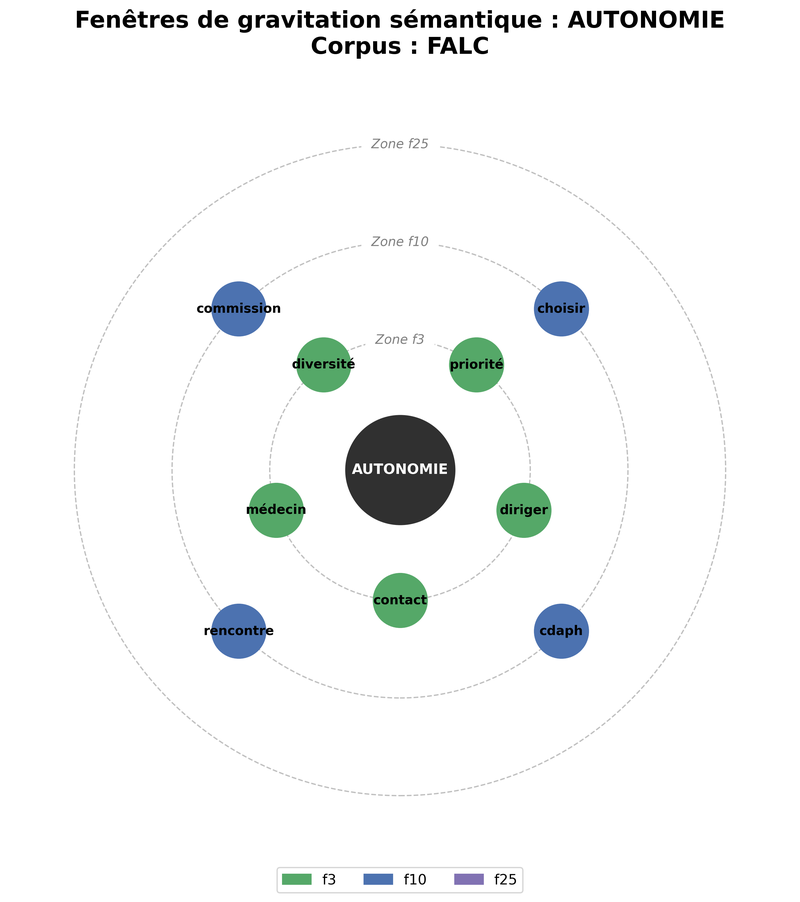
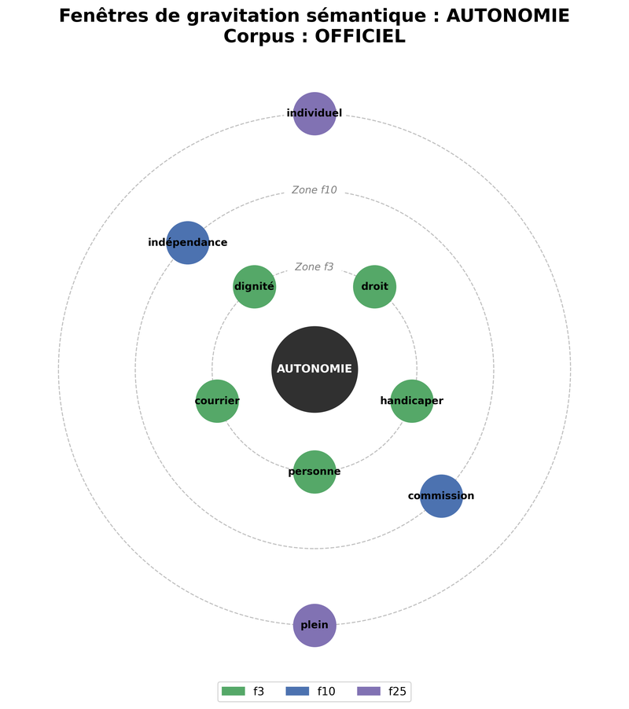

# TP2 - Influence de la taille du contexte
**Morgane Bona-Pellissier**, Master 1 pluriTAL  
morgane@bona-pellissier.net  

L’ensemble de ce projet est disponible sur le dépôt suivant : `https://github.com/crispyfunicular/semantique-distributionnelle/tp2`

## Choix du corpus
### Choix des textes
Pour ce travail, nous avons choisi d’étudier, outre l’influence de la taille du contexte sur la similarité cosinus, l’éventuelle incidence de la rédaction de textes en « facile à lire et à comprendre » (FALC) sur les résultats obtenus.  
Nous avons donc élaboré un corpus parallèle constitué des quelques textes institutionnels disposant d’une version en FALC, en l’occurrence :
- la Charte des droits fondamentaux de l’Union européenne (CDFUE) ;
- la Convention internationale sur les Droits des personnes handicapées (CDPH) ;
- la Circulaire du 10-7-2024 relative aux droits des étudiants en situation de handicap ou avec un trouble de santé invalidant.

L’ensemble des corpus « officiels », d’une part, et l’ensemble des corpus « FALC », d’autre part, ont été fusionnés en deux corpus `officiel.txt` et `FALC.txt`, respectivement.  
S’il est vrai que ce corpus peut sembler peu étoffé, nous avons fait le choix, compte tenu de la difficulté à trouver des documents institutionnels « traduits » en FALC, de privilégier la qualité d’un corpus strictement parallèle à la quantité d’un corpus comparable plus vaste mais thématiquement hétérogène. 

### Hypothèse
Nous partons de l’hypothèse que, si les deux textes partagent un référentiel sémantique strictement identique, ils mobilisent pourtant des stratégies syntaxiques et lexicales opposées. En effet, le texte officiel devrait se caractériser par une forte densité conceptuelle et des phrases complexes, tandis que la version FALC devrait s’appuyer sur une syntaxe courte et un vocabulaire concret et désambiguïsé.

Parmi les « Règles européennes pour une information facile à lire et à comprendre » (Inclusion Europe, 2009), les recommandations suivantes nous intéressent particulièrement pour ce travail :
```text
6.  Utilisez des mots faciles à comprendre  
    c’est-à-dire des mots que les gens connaissent bien.
7.  N’utilisez pas de mots difficiles.
14. Faites toujours des phrases courtes.
17. Utilisez des phrases actives plutôt que des phrases passives
    quand vous le pouvez
18. Placez toujours vos informations
    dans un ordre facile à comprendre et facile à suivre.
```
Il nous a par conséquent semblé pertinent de comparer les comportements vectoriels obtenus pour chacun de ces textes selon la taille de la fenêtre d’observation.


## Structure de la pipeline
> Voir `tp2.py`
### Segmentation et tokenisation et filtrage des mots vides (*stopwords*)
### Filtrage des mots vides (stopwords)
Nous avons défini une fonction `preparer_corpus()` prenant en argument un texte et, de façon optionnelle, un booléen `stopwords` fixé par défaut à `False` pour le filtrage des stopwords. Afin de privilégier l’émergence de relations sémantiques pertinentes et de réduire le bruit statistique, l’analyse finale présentée dans ce rapport se concentre exclusivement sur les matrices construites après le filtrage des mots vides (*stopwords*)

### Choix des fenêtres
Nous avons retenu trois tailles de fenêtres distinctes pour observer l’évolution des voisinages :
- Fenêtre étroite (`f3`) : pour capter la syntaxe immédiate (collocations, relations Sujet-Verbe-Objet).
- Fenêtre moyenne (`f10`) : pour capter l’échelle d’une phrase simple ou d’une proposition.
- Fenêtre large (`f25`) : pour capter l’échelle d’une phrase complexe ou d’un réseau thématique élargi.

Cette augmentation progressive de la largeur de la fenêtre, et tout particulièrement `f25`, devraient également permettre de faire apparaître un effet de plateau sur le corpus FALC : la syntaxe courte caractéristique de ces textes devrait borner le voisinage sémantique au-delà d’une certaine largeur de fenêtre, les résultats cessant alors d’évoluer.

```python
# MATRICES CDPH_OFFICIEL
## Avec stopwords - fenêtre 2
mat_off_w2 = construire_matrice(corpus_officiel, taille_fenetre=2)

## Avec stopwords - fenêtre 15
mat_off_w15 = construire_matrice(corpus_officiel, taille_fenetre=15)

## Avec stopwords - fenêtre 50
mat_off_w15 = construire_matrice(corpus_officiel, taille_fenetre=50)
```

### Choix des mots cible
Nous avons choisi des mots cibles de façon à couvrir l’ensemble des dimensions sémantiques du corpus :
- acteurs clé : personne, enfant, femme, handicapé ;
- enjeux et notions au cœur de la Convention : dignité, accessibilité, autonomie ;
- concepts juridiques : droit, discrimination, liberté.
- Mots du quotidien (absents du texte officiel) : argent, chose.

Nous partons de l’hypothèse que cette dernière catégorie en particulier, celle des concepts juridiques, devrait donner lieu à de fortes variations entre le corpus « officiel » et le corpus « FALC », car nous supposons que ce sont précisément ces notions juridiques abstraites qui sont vulgarisées pour le grand public dans les versions « faciles à lire et à comprendre ».

```python
mots_cible = ["droit", "personne", "handicapé", "enfant", "femme", "discrimination", "liberté", "dignité", "accessibilité", "autonomie", "argent", "chose"]
```


## Discussion des résultats
> Voir `resultats.md`

### Mots absents de l’un des corpus : abstrait vs. concret
#### Mots absents du corpus officiel : « argent » et « chose »

Les mots « argent » et « chose », absents du corpus officiel, appartiennent au langage courant et désignent des réalités *concrètes* du quotidien, dépourvues de définition technique propre au langage de spécialité juridique. Leur présence exclusive dans le corpus FALC confirme la stratégie de simplification consistant à substituer aux concepts abstraits des termes immédiatement accessibles. D’ailleurs, en `f3`, « argent » est associé à « situation », « vie » et « handicap », tandis qu’en `f10`, il apparaît dans un réseau financier concret (« bourse », « bcs », « mérite », « somme »), ce qui témoigne d’un ancrage dans la réalité matérielle du lecteur.

#### Mots du champ philosophique : « dignité » et « autonomie »

À l’inverse, les mots « dignité » et « autonomie » révèlent un fort contraste de traitement entre les deux corpus. Dans le corpus officiel, « dignité » est associée en `f3` à un vocabulaire juridique technique (« inhérent », « intrinsèque »), tandis que dans le corpus FALC, elle est reformulée en termes concrets et incarnés (« respecter », « humain », « esclave »). De même, « autonomie » gravite autour de « commission », « indépendance » et « dignité » dans le corpus officiel, quand le FALC l’ancre dans la sphère médicale et administrative quotidienne (« médecin », « cdaph », « contact »). Ce sont précisément les noms abstraits qui donnent lieu de manière quasi systématique à des reformulations pour faciliter la compréhension du lectorat (Eshkol-Taravella et Grabar, 2018).

### Incidence de la taille de la fenêtre
#### Fenêtre étroite (`f3`)
- **Collocations juridiques dans le corpus officiel**

Avec une fenêtre étroite, la similarité cosinus est calculée sur les voisins immédiats (trois mots), ce qui permet de capturer les collocations et les expressions figées propres au français juridique. Ainsi, pour « discrimination », on retrouve « fonder » et « approprier » (pour l’expression « mesures appropriées fondées sur... »), et pour « femme », « jouissance » et « base » (pour « jouissance [...] sur la base de l’égalité »). De même, « dignité » est associée à « inhérent » et « intrinsèque », collocations caractéristiques du style des préambules de conventions internationales. Ces résultats montrent que la fenêtre étroite est principalement sensible au jargon institutionnel et à la syntaxe figée des textes juridiques.

- **Syntaxe directe du FALC : verbes d’action et vocabulaire concret**

Dans le corpus FALC, la même fenêtre `f3` révèle un fonctionnement radicalement différent. En raison de la structure syntaxique simplifiée (sujet-verbe-objet), l’environnement immédiat des mots rend directement visible l’action concrète. Par exemple, « discrimination » est associée à « subir », « torturer » et « braille », et « femme » à « fille » et « assurer ». Ce résultat met en évidence le fait que, là où le texte officiel encadre le mot par des formules juridiques, le FALC l’associe à des réalités directement perceptibles, conformément aux règles 6, 7 et 14 citées plus haut.

#### Fenêtre moyenne (`f10`)
- **Émergence du cadre normatif dans le corpus officiel**

La fenêtre de dix mots permet de dépasser les collocations immédiates et de capturer le cadre normatif dans lequel s’insèrent les concepts. Ainsi, « droit » gagne « reconnaître » et « liberté », « personne » s’associe à « autre » et « handicaper », et « enfant » à « égalité ». Pour « femme », on voit apparaître « violence », signe que la fenêtre est suffisamment large pour relier le sujet aux enjeux thématiques de l’article. Le verbe « reconnaître », qui apparaît pour plusieurs mots cibles, traduit la dimension performative du droit : les États « reconnaissent » les droits énoncés.

- **Ancrage du FALC dans la vie quotidienne**

À la même échelle de dix mots, le corpus FALC fait apparaître un réseau sémantique ancré dans le quotidien. Pour « enfant », les voisins sont « séparer », « handicapé » et « personne » ; pour « handicapé », on trouve « demande » et « faire ». Le mot « femme » est associé à « homme », « sage » (pour « sage-femme ») et « dentiste », un réseau thématique fondé sur des métiers et des relations concrètes plutôt que sur des obligations étatiques. Ainsi, à la même échelle, la méthode de simplification ne modifie pas seulement la forme : elle recentre le champ sémantique sur la sphère intime et quotidienne du lecteur.

#### Fenêtre large (`f25`)

L’observation des variations entre les fenêtres moyenne (`f10`) et large (`f25`) valide mathématiquement l’hypothèse structurelle du FALC, à savoir la règle des phrases courtes (règle 14).

- **Effet de plateau (FALC)**

Pour de nombreux termes, la liste des co-occurrences reste strictement identique ou quasi identique entre `f10` et `f25`. C’est le cas de façon particulièrement nette pour « autonomie » (dont les cinq voisins « médecin, cdaph, choisir, commission, rencontre » sont strictement identiques), pour « accessibilité » et « argent » (où seul un léger réordonnement est observable), et pour « liberté » (mêmes termes avec une substitution marginale). L’algorithme se heurte aux limites physiques de la phrase courte : dès 10 mots, le contexte sémantique est saturé ; l’élargir à 25 mots n’apporte plus d’information nouvelle. Ce phénomène confirme l’hypothèse avancée plus haut : la fenêtre glissante de 25 mots dépasse les frontières de la phrase dans le corpus FALC, et le voisinage sémantique se trouve borné par la syntaxe.

| Mot cible     | `f10` (FALC)                                     | `f25` (FALC)                                     | Δ        |
|:--------------|:-------------------------------------------------|:-------------------------------------------------|:---------|
| autonomie     | médecin, cdaph, choisir, commission, rencontre   | médecin, cdaph, choisir, commission, rencontre   | = 0/5    |
| accessibilité | autour, cvec, améliorer, commun, culturel        | autour, cvec, améliorer, campus, culturel        | ≈ 1/5    |
| argent        | bcs, bourse, mérite, faire, somme                | bcs, bourse, mérite, somme, récompenser          | ≈ 1/5    |
| liberté       | fondamental, droit, art, souhaiter, union        | fondamental, droit, européen, union, art         | ≈ 1/5    |

- **Expansion thématique du corpus officiel**

À l’opposé, la complexité des phrases officielles empêche toute stagnation. La fenêtre de 25 mots a l’espace nécessaire pour relier le concept de départ à ses implications et capturer des réseaux thématiques plus larges. Pour « femme », on passe de l’action (« jouissance », « droit ») en `f3` à des enjeux globaux (« courir », « violence », « politique ») en `f25`. Pour « handicapé », les voisins glissent de « enfant, personne, travailleur » en `f10` vers « personne, enfant, mesure, autre » en `f25`, faisant apparaître la notion de « mesure » (législative). Pour « enfant », le mot « famille », absent en `f10` apparaît en `f25`, signe d’une ouverture au réseau social.

| Mot cible     | `f10` (Officiel)                                 | `f25` (Officiel)                                  |
|:--------------|:-------------------------------------------------|:--------------------------------------------------|
| handicapé     | enfant, personne, travailleur, handicaper, être  | personne, enfant, mesure, handicaper, autre       |
| enfant        | handicapé, droit, personne, tout, égalité        | handicapé, droit, personne, égalité, famille      |
| femme         | fille, violence, autre, tout, handicaper         | fille, souvent, courir, violence, politique       |

L’élargissement à `f25` fait glisser le champ lexical des *acteurs immédiats* en `f10` aux *enjeux sociétaux et institutionnels* en `f25`. Cette évolution illustre la capacité des longues phrases juridiques à relier la règle de droit à ses implications lointaines au sein d’une même unité syntaxique.

## Conclusion

L’analyse sémantique comparative entre les textes officiels et leur traduction en FALC démontre que l’architecture syntaxique dicte la pertinence du paramétrage algorithmique. En effet, l’efficacité des fenêtres glissantes s’est révélée diamétralement opposée selon le corpus étudié.

### Efficacité de la fenêtre étroite (`f3`) pour le FALC vs. limites de l’officiel
Dans le corpus FALC, la fenêtre `f3` s’avère extrêmement performante pour capturer le cœur sémantique des concepts. En raison de sa structure syntaxique simplifiée et directe (sujet-verbe-objet), l’environnement immédiat des mots révèle directement l’action concrète ou la reformulation pédagogique (par exemple, « dignité » directement associée à « respecter » et « humain »). À l’inverse, pour le corpus officiel, cette même fenêtre `f3` reste « piégée » dans la rhétorique institutionnelle, capturant quasi-exclusivement des collocations juridiques figées (« inhérent », « intrinsèque », « jouissance ») sans parvenir à atteindre le sens profond du droit édicté.

### Efficacité de la fenêtre large (`f25`) pour l’officiel vs. effet plafond du FALC
À l’opposé, la fenêtre large `f25` révèle toute sa pertinence sur le corpus officiel. C’est à cette échelle macro-syntaxique que l’algorithme parvient à embrasser la complexité des longues phrases juridiques. Elle permet de franchir le mur du jargon réglementaire pour révéler les enjeux sociétaux et les réalités institutionnelles du texte (reliant par exemple « femme » à « politique », ou « enfant » à « famille »). Appliquée au corpus FALC, cette même fenêtre `f25` est en revanche inutile : elle se heurte à un « effet plafond » algorithmique imposé par la règle des phrases courtes. L’information stagne dès `f10`, comme l’illustrent les résultats identiques pour « autonomie » entre `f10` et `f25`.

En définitive, cette étude illustre mathématiquement le succès de la démarche de simplification du FALC. En ramenant l’information essentielle dans un périmètre syntaxique extrêmement restreint (capturable dès `f3`), le FALC supprime la charge cognitive nécessaire pour lier des concepts éloignés, une charge qui caractérise le corpus officiel et qui requiert, algorithmiquement comme humainement, une fenêtre de lecture beaucoup plus large (`f25`).

<table>
<tr>
<td></td>
<td></td>
</tr>
</table>

## Bibliographie
> Association métropolitaine et départementale des parents et amis de personnes handicapées mentales (Adapei 69) (2024). https://www.adapei69.fr/sites/default/files/2024-04/Charte%20Droits%20UE_%20FALC_Adapei%2069.pdf 

> Eshkol-Taravella, I. et N. Grabar (2018). « La reformulation comme un moyen de clarification des noms abstraits ». Les catégories abstraites et la référence, 6, ÉPURE-Éditions et Presses universitaires de Reims. halshs-01968306

> Fondation Internationale de la Recherche Appliquée sur le Handicap (FIRAH). « Version facile à lire de la Convention relative aux droits des personnes handicapées ». https://www.firah.org/la-convention-relative-aux-droits-des-personnes-handicapees.html

> Haut-Commissariat des Nations Unies aux droits de l’homme (2006). « Convention relative aux droits des personnes handicapées ». https://www.ohchr.org/fr/instruments-mechanisms/instruments/convention-rights-persons-disabilities

> Inclusion Europe (2009). « Règles européennes pour une information facile à lire et à comprendre ». https://www.inclusion-europe.eu/easy-to-read-standards-guidelines/ 

> Ministère de l’Enseignement supérieur et de la Recherche (2024). Circulaire du 10-7-2024 relative aux droits des étudiants en situation de handicap ou avec un trouble de santé invalidant. Bulletin officiel de l’Enseignement supérieur et de la Recherche. https://www.enseignementsup-recherche.gouv.fr/fr/bo/2024/Hebdo28/ESRS2418046C

> Parlement européen. Charte des droits fondamentaux de l’Union européenne. https://www.europarl.europa.eu/charter/pdf/text_fr.pdf